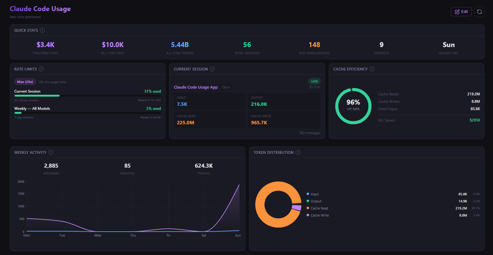

# Claude Code Usage

A lightweight desktop app that shows your Claude Code usage stats in real-time. Built with Tauri v2 + React + TypeScript.

 



## Features

- **Real-time plan usage** — Shows exact session (5h rolling) and weekly usage percentages from Anthropic's API
- **Per-project breakdown** — Token usage, estimated cost, messages, and sessions for every project
- **13 dashboard widgets** — Charts, stats, tables, all customizable
- **System tray** — Runs in the background, click to open, right-click to quit
- **Auto token refresh** — OAuth tokens refresh automatically, no manual login needed
- **Claude Code detection** — Shows a friendly message if Claude Code isn't installed
- **Cross-platform** — Windows (.exe/.msi) and macOS (.dmg) installers

## Widgets

| Widget | Description |
|--------|-------------|
| Quick Stats | Weekly cost, all-time cost, total tokens, sessions, projects, busiest day |
| Rate Limits | Session & weekly usage % with progress bars (real data from Anthropic API) |
| Current Session | Live token breakdown (input/output/cache) for active session |
| Cache Efficiency | Cache hit rate gauge with estimated cost savings |
| Weekly Activity | Area chart of messages and sessions over 7 days |
| Token Distribution | Donut chart of token types (input/output/cache read/write) |
| Cost by Project | Bar chart of top 10 projects by estimated cost |
| Top Projects | Horizontal bar chart of top 5 by token usage |
| Daily Token Types | Stacked bars showing messages vs tool calls per day |
| Session Timeline | Area chart of sessions and tool calls over the week |
| Projects | Sortable table of all projects with usage stats |
| Model Breakdown | Per-model token usage (Opus, Sonnet, Haiku) |

## How It Works

The app reads local data from `~/.claude/` (created by Claude Code) and optionally calls Anthropic's usage API:

| Data Source | What It Provides |
|-------------|-----------------|
| `~/.claude/projects/*/[session].jsonl` | Per-project tokens, messages, sessions |
| `~/.claude/sessions/*.json` | Active session detection (PID checking) |
| `~/.claude/stats-cache.json` | Total sessions/messages, model usage |
| `~/.claude/.credentials.json` | OAuth token for API calls (access token only, never exposed) |
| `api.anthropic.com/api/oauth/usage` | Real usage percentages and reset times |

**Security:** The app only reads local files and calls Anthropic's own API. It never sends data to third parties, never displays tokens, and never modifies any files (except refreshing the OAuth token when it expires).

## Installation

### Download

| Platform | Installer |
|----------|-----------|
| Windows (exe) | [Download](https://github.com/nejisharma/Claude-Code-Usage/releases/download/v1.0.4/Claude.Code.Usage_1.0.4_x64-setup.exe) |
| Windows (msi) | [Download](https://github.com/nejisharma/Claude-Code-Usage/releases/download/v1.0.4/Claude.Code.Usage_1.0.4_x64_en-US.msi) |
| macOS (Apple Silicon) | [Download](https://github.com/nejisharma/Claude-Code-Usage/releases/download/v1.0.4/Claude.Code.Usage_1.0.4_aarch64.dmg) |
| macOS (Intel) | [Download](https://github.com/nejisharma/Claude-Code-Usage/releases/download/v1.0.4/Claude.Code.Usage_1.0.4_x64.dmg) |

Or browse all releases: [github.com/nejisharma/Claude-Code-Usage/releases](https://github.com/nejisharma/Claude-Code-Usage/releases)

### Requirements

- [Claude Code](https://docs.anthropic.com/en/docs/claude-code/overview) must be installed and logged in at least once
- Works with all Claude Code subscription plans (Free detection, Pro, Max 5x, Max 20x, Team, Enterprise)

## Development

### Prerequisites

- [Node.js](https://nodejs.org/) 18+
- [Rust](https://rustup.rs/) 1.70+
- Platform-specific dependencies for [Tauri v2](https://v2.tauri.app/start/prerequisites/)

### Setup

```bash
git clone https://github.com/nejisharma/Claude-Code-Usage.git
cd Claude-Code-Usage
npm install
```

### Dev Mode

```bash
npm run tauri dev
```

### Build

```bash
npm run tauri build
```

Installers are generated in `src-tauri/target/release/bundle/`.

## Project Structure

```
src/                          # React frontend
  components/
    Dashboard.tsx             # Main dashboard with widget layout
    RateLimits.tsx            # Plan usage bars (API-backed)
    SessionUsage.tsx          # Current session stats
    WeeklyUsage.tsx           # Weekly area chart
    TokenDistribution.tsx     # Token type donut chart
    CacheEfficiency.tsx       # Cache hit rate gauge
    CostBreakdown.tsx         # Cost per project bar chart
    TopProjects.tsx           # Top projects horizontal bars
    DailyTokens.tsx           # Daily messages/tools chart
    SessionTimeline.tsx       # Sessions/tools area chart
    ProjectsTable.tsx         # Sortable projects table
    ModelBreakdown.tsx        # Per-model usage
    QuickStats.tsx            # Summary stat cards
    AddWidgetModal.tsx        # Widget toggle modal
    NotInstalled.tsx          # Claude Code not found screen
  widgets/
    WidgetWrapper.tsx         # Widget chrome (title, tooltip, close)
    registry.ts               # Widget definitions + layout persistence
  hooks/
    useUsageData.ts           # Data fetching with auto-refresh
  types.ts                    # TypeScript interfaces
  styles/globals.css          # All styles (dark theme)

src-tauri/                    # Rust backend
  src/
    main.rs                   # Tauri app setup, tray, window management
    usage.rs                  # Data collection, API calls, token refresh
  Cargo.toml                  # Rust dependencies
  tauri.conf.json             # App config (window, bundle, identity)
  icons/                      # App icons (all sizes)
```

## API & Data Privacy

- **Read-only:** The app never modifies your Claude Code data
- **Local first:** All project stats come from local JSONL files
- **API calls:** Only to `api.anthropic.com` for usage percentages (every 5 minutes, cached)
- **Token handling:** OAuth tokens are read from the local credentials file, sent only to Anthropic over HTTPS, auto-refreshed when expired, never logged or displayed
- **No telemetry:** The app sends no analytics or tracking data anywhere

## Tech Stack

- **Frontend:** React 19, TypeScript, Recharts
- **Backend:** Rust, Tauri v2
- **HTTP:** reqwest (Rust) for API calls
- **Bundle size:** ~3MB installer, ~40MB RAM usage

## License

MIT

## Author

Neeraj Sharma
https://neeraj.ca

---

Built with Claude Code. ♥
